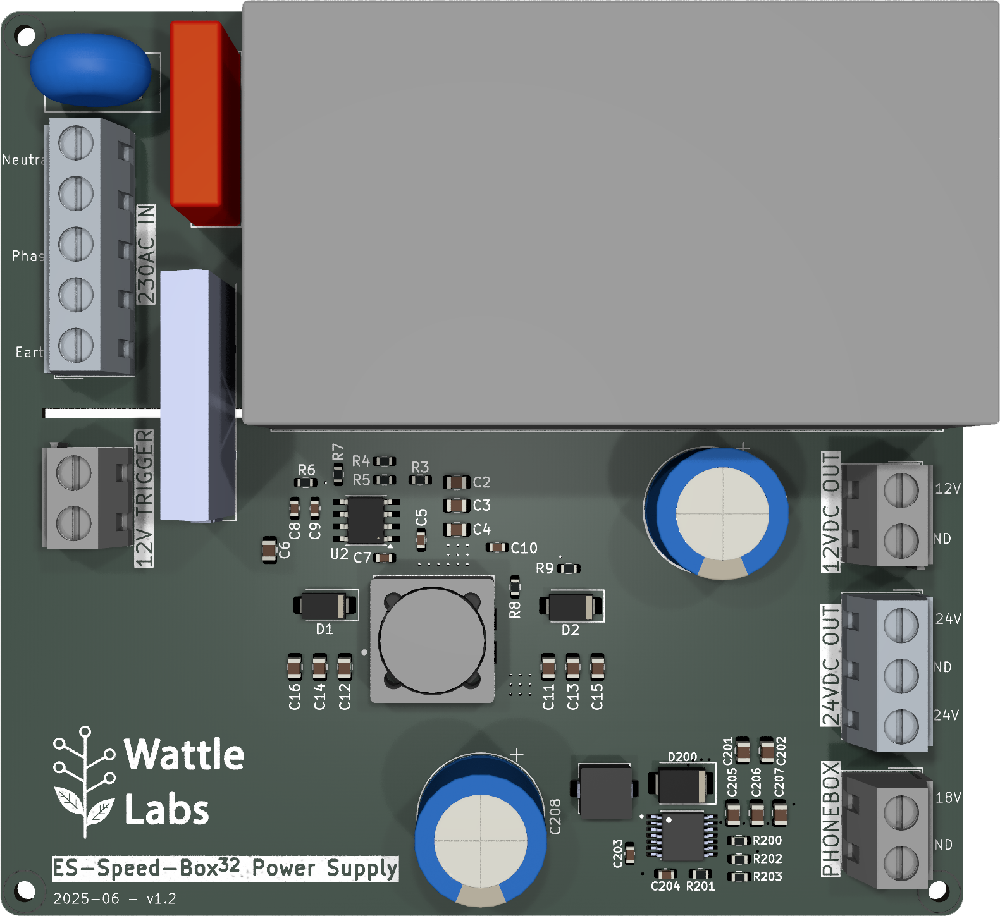
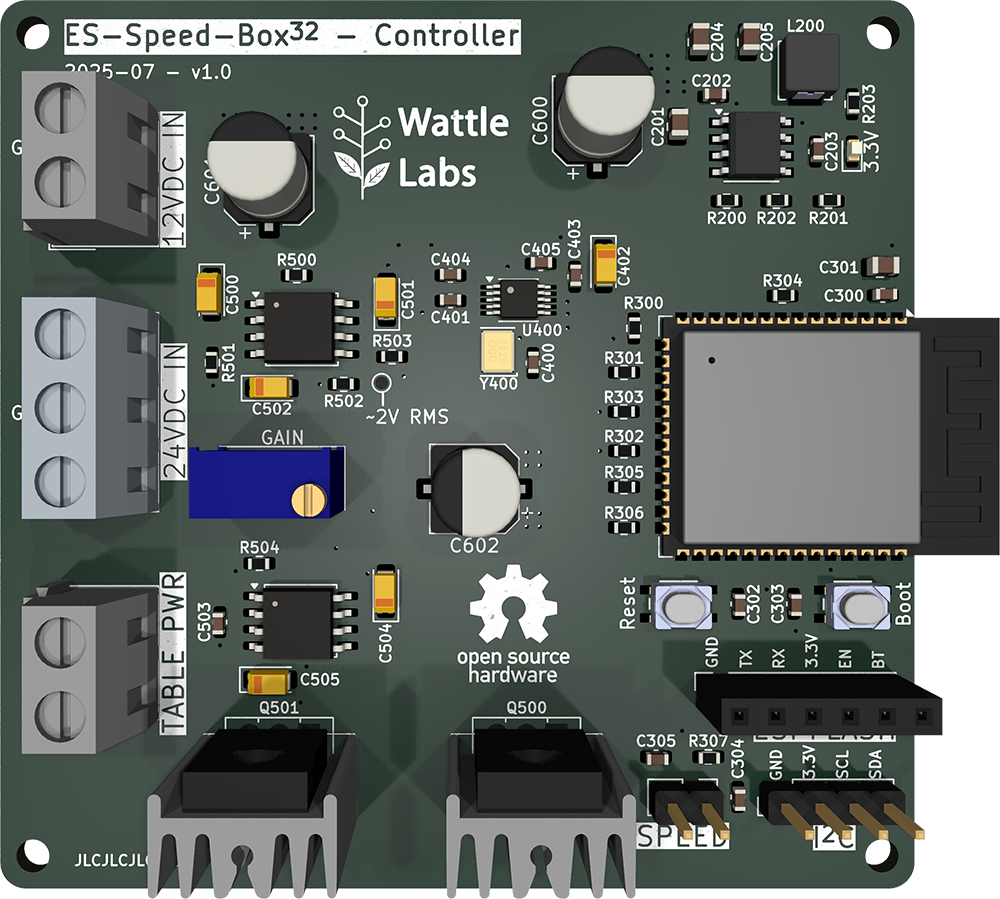

# ES-Speed-Box for controlling Pro-Ject Turntables with 16VAC Synchronous Motors.

## Status:

Prototype.

## Introduction:

A speed controller to suit Pro-Ject Turntables with 16VAC synchronous motors (Expression 3, etc). A clone of sorts of the off the shelf line of Pro-ject "SpeedBox" devices that allows for 33RPM and 45RPM speed selection electronically instead of changing the belt/pulley beneath the turntable platter.

Speed selection is controlled in software using a DDS (direct digital synthesis) IC to generate a sinusoidal waveform of the appropriate frequency (~50Hz for 33RPM, ~67 for 45RPM). An I2C header allows for an optional external OLED screen to display speed selection. An 18VDC output provides power to a Pro-Ject Phonobox. The device can be WiFi enabled to allow the speed to be controlled remotely using MQTT auto-discovery via HomeAssistant.

Power to the circuit is controlled via an SSR (solid state relay) and is intended to be connected to a 12V amplifier trigger output. Thus the device has no phantom power draw and only powers the turntable when the amplifier trigger output is on.

## Project Goals:

1. Powered on when the amplifier is on/phono aux input is on.
2. Provide power to both the turntable but also an Phono Box II pre-amp.
3. I2C interface to allow connection of an OLED screen to display speed and amp volume (amp volume via Yamaha API).
4. Low profile design to fit in a small rack mountable case.

